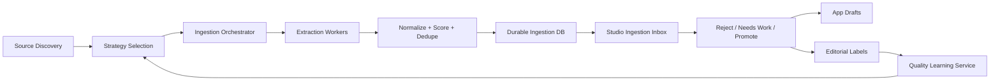

# Ingestion System Architecture (v1)

## 1) Architectural Goals

1. Ingest from many sources with source-specific strategy.
2. Preserve raw evidence and provenance.
3. Deliver high-signal candidates to Studio.
4. Improve quality continuously from editorial feedback.
5. Run safely and reliably on schedules.

## 2) High-Level Components

1. Source Intelligence Service:
   - discovers candidate sources/pages
   - scores source quality and maintenance risk
   - selects extraction strategy per source

2. Ingestion Orchestrator:
   - schedules and runs jobs
   - coordinates discover -> extract -> normalize -> score -> persist

3. Extraction Worker Runtime:
   - applies strategy modules (API, sitemap, HTML selectors, PDF/ICS, headless fallback)
   - emits structured candidates + extraction metadata

4. Durable Ingestion Store:
   - system of record for runs/pages/candidates/traits/logs
   - independent from app editorial schema churn

5. Studio Inbox:
   - human review and promotion control surface

6. Quality Learning Service:
   - consumes editorial labels
   - tunes heuristics/models
   - updates source and strategy configs

7. Observability + Ops:
   - metrics, alerts, incident runbooks, replay tooling

## 3) Reference Flow

## 4) Design Constraints

1. No direct scraper writes to `ideas` publish tables.
2. Promotion to drafts must be human initiated and idempotent.
3. Every candidate must retain source attribution (`source_url`).
4. Every run must be replayable from durable data.

## 5) Deployment Shape

Recommended:

1. Studio web app (current repo) for review/editorial operations.
2. Ingestion runtime (same repo or service folder) for jobs/workers.
3. Separate ingestion Supabase project for durable store.
4. Existing app Supabase project for drafts/publishing.

## 6) Interface Boundaries

1. Ingestion DB:
   - internal machine data and audit history
2. App DB:
   - editorial content lifecycle
3. Contract:
   - promotion maps candidate -> draft with traceable IDs

## 7) Reliability Requirements

1. Idempotent writes at each step.
2. Retry with backoff and source-level failure isolation.
3. Partial-run completion and resumability.
4. Run snapshots for forensic replay.
